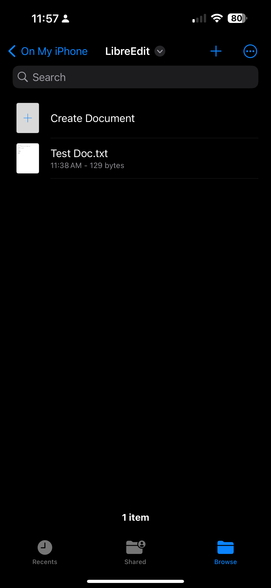
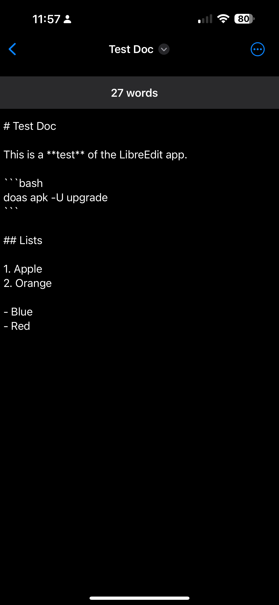
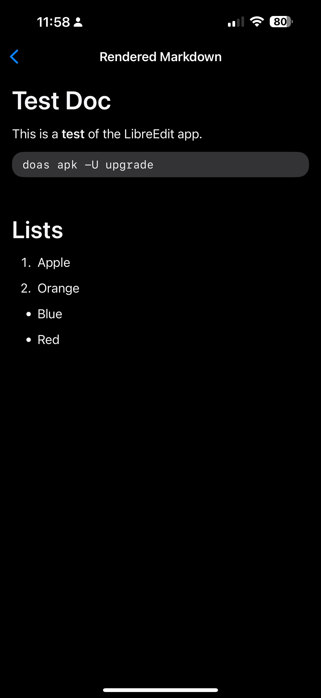

# LibreEdit

LibreEdit intended to be a simple open-source text editing app for iOS, written
in Swift.

LibreEdit integrates with the native iOS file manager, allowing users full
control over the files themselves. The editor is simple and should display all
file types.

There is an option to view rendered Markdown in the secondary actions menu in
the naviation bar.

## Screenshots

Native file manager:

Editor:

Rendered Markdown:

