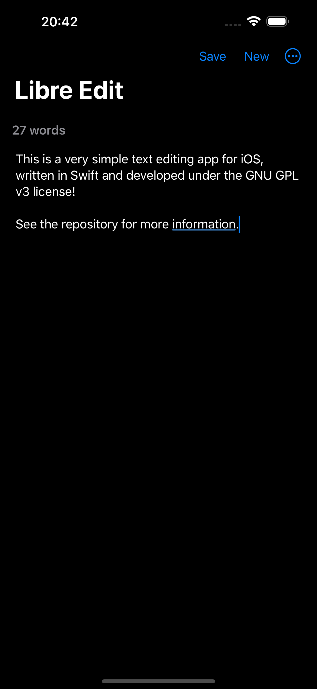

# LibreEdit

LibreEdit intended to be a simple open-source text editing app for iOS, written
in Swift.

## TODO

- [ ] Add functionality to `New` button.
- [ ] Allow custom file names when saving.
- [ ] Allow editing of existing files.

## Screenshots

